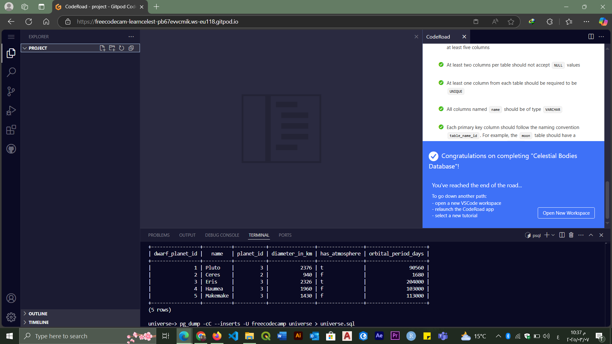
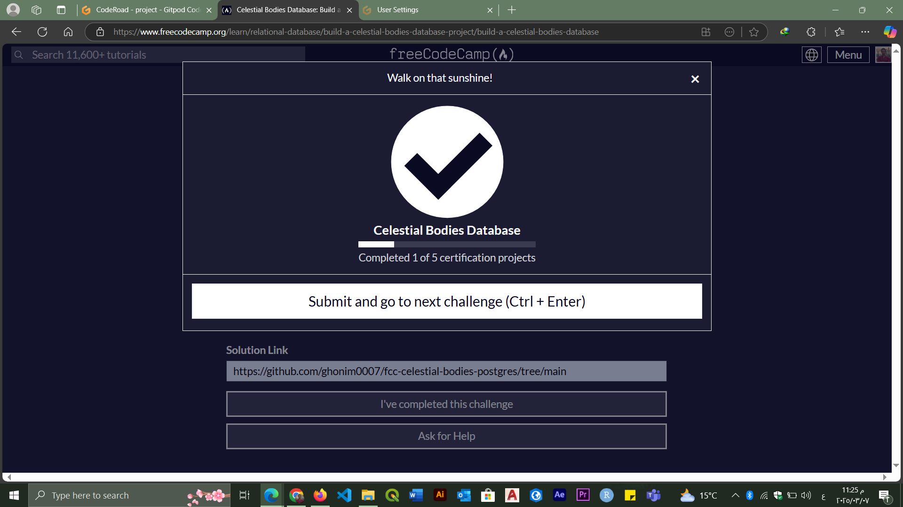

# Universe Database

This project is a PostgreSQL database that contains information about galaxies, stars, planets, and moons.

## How to Use
1. Run the following command to restore the database:
   ```sh
   psql -U postgres < universe.sql
   ```

## Completion Proof
Below are the images that confirm the completion of this project:

  


